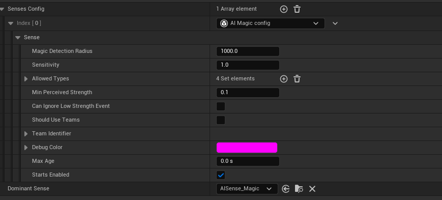

# Unreal Engine 5 custom magic sense by CAPMARE DAVID NICUSOR for Gameplay Programming course at DAE sem4 


--------------------

## Features
- Team id
- Magic falloff
- Affected by physical materials
- Magic types
- Detection radius
- Power based range
- Event lifetime
- Threat level


# How to use

## Adding perception
Add the AIPerception component to your character


You can expand the Allowed Types struct to select which types of magic your character can perceive


## Reporting events
Every actor that has the magic sense will receive the event.


-------------------

## First step
We will need to add ```AIModule``` to our ```PublicDependencyModuleNames```
```
public class CustomMagicSense : ModuleRules
{
	public CustomMagicSense(ReadOnlyTargetRules Target) : base(Target)
	{
		PCHUsage = PCHUsageMode.UseExplicitOrSharedPCHs;

		PublicDependencyModuleNames.AddRange(new string[] { "AIModule", "Core", "CoreUObject", "Engine", "InputCore", "EnhancedInput" });
	}
}

```

# Implementation

## Implementation explanation

The unreal engine sense system can be very complicated at the beginning but once you have the basic set up done for a custom sense the rest is just pure gameplay logic.
I will showcase how to build the basic setup and how we can improve it. If you already know or read other resources about how to create the custom sense you should skip to the *Gameplay* where i will be explaining the gameplay logic.

## Creating the sense and sense config
Unreal Engine senses requiere a sense config for your custom sense, the sense config is just a header file that we will use to store the variables and access them from blueprints.

Our header should be inheriting from ```UAISenseConfig```, a simple implementation of the header file should look like this.
### AISenseConfig_Magic.h
```C++
UCLASS(meta = (DisplayName = "AI Magic config"), BlueprintType)
class CUSTOMMAGICSENSE_API UAISenseConfig_Magic : public UAISenseConfig
{
	GENERATED_BODY()
public:
	UAISenseConfig_Magic(const FObjectInitializer& ObjectInitializer);

	virtual TSubclassOf<UAISense> GetSenseImplementation() const override;
};
```
If you add variables here when you add your sense config to you will see them in your AIPerception component


In the .cpp you need return the sense implementation of your sense. 
Lets create the sense first and then we will back to the config.

This is the simplest implementation that we can have for our sense


### AISense_Magic.h 
```C++
UCLASS()
class CUSTOMMAGICSENSE_API UAISense_Magic : public UAISense
{
    GENERATED_BODY()
public:
    UAISense_Magic(const FObjectInitializer& ObjectInitializer);

    // implement bindings for the listener
    void OnNewListener(const FPerceptionListener& NewListener);
    void OnListenerUpdate(const FPerceptionListener& UpdatedListener);
    void OnListenerRemoved(const FPerceptionListener& UpdatedListener);

    virtual float Update() override;

private:

};
```

The next step is going back to our Sense config .cpp file and return the implementation of our sense so we can access it when we need it directly from the sense config.

### AISenseConfig_Magic.cpp

```C++
UAISenseConfig_Magic::UAISenseConfig_Magic(const FObjectInitializer& ObjectInitializer)
{
	DebugColor = FColor::Magenta;
}

TSubclassOf<UAISense> UAISenseConfig_Magic::GetSenseImplementation() const
{
	return UAISense_Magic::StaticClass();
}
```

Ok, we are basically done with our sense config, we wont need to touch it anymore except if we ever want to expose variables to blueprints which we will when we start doing gameplay logic.

Back to our ```AISense_Magic.h``` we left some functions without the implementation, we need to bind the following functions 
```OnNewListener(const FPerceptionListener& NewListener)```, ```OnListenerUpdate(const FPerceptionListener& UpdatedListener)``` and ```OnListenerRemoved(const FPerceptionListener& UpdatedListener)``` we will do the bindings in the constructor.

All 3 delegates are of type ```FOnPerceptionListenerUpdateDelegate``` which are inherited from the ```AISense.h```

### AISense_Magic.cpp 
```C++
UAISense_Magic::UAISense_Magic(const FObjectInitializer& ObjectInitializer) : Super(ObjectInitializer)
{
    // set bindings
    OnNewListenerDelegate.BindUObject(this, &UAISense_Magic::OnNewListener);
    OnListenerUpdateDelegate.BindUObject(this, &UAISense_Magic::OnListenerUpdate);
    OnListenerRemovedDelegate.BindUObject(this, &UAISense_Magic::OnListenerRemoved);
}
```

The next step is implementing the ```UAISense_Magic::OnNewListener``` function, but before that we a way to consume properties from our config, we will create a struct that matches the pattern of our sense config. 
For now we dont have any variables in our sense config so we will just create a empty struct that takes our config as parameter in the constructor

```c++
USTRUCT(BlueprintType)
struct FDigestedMagicProperties {
    GENERATED_USTRUCT_BODY()

    FDigestedMagicProperties();
    FDigestedMagicProperties(const UAISenseConfig_Magic& SenseConfig);
};

```

We will now add a ```TMap``` of our digested properties togheter with a listener id in our ```UAISense_Magic``` class

```C++
    // Store digested properties for each listener
    TMap<FPerceptionListenerID, FDigestedMagicProperties> DigestedProperties;
```

Now we can implement our ```UAISense_Magic::OnNewListener``` function

```C++
void UAISense_Magic::OnNewListener(const FPerceptionListener& NewListener)
{
    UE_LOG(LogTemp, Display, TEXT("New Magic listener"))

    UAIPerceptionComponent* ListenerPtr = NewListener.Listener.Get();
    check(ListenerPtr);

    const UAISenseConfig_Magic* SenseConfig = Cast<const UAISenseConfig_Magic>(ListenerPtr->GetSenseConfig(GetSenseID()));
    check(SenseConfig);

    const FDigestedMagicProperties PropertyDigest(*SenseConfig);
    DigestedProperties.Add(NewListener.GetListenerID(), PropertyDigest);
}

```

We dont need anything extra for the ```UAISense_Magic::OnListenerUpdate``` nor the ```UAISense_Magic::OnListenerRemoved```

```C++
void UAISense_Magic::OnListenerUpdate(const FPerceptionListener& UpdatedListener)
{
    const FPerceptionListenerID ListenerID = UpdatedListener.GetListenerID();

    // make sure is a valid listener
    if (UpdatedListener.HasSense(GetSenseID()))
    {
        UAIPerceptionComponent* ListenerPtr = UpdatedListener.Listener.Get();
        if (ListenerPtr)
        {
            const UAISenseConfig_Magic* SenseConfig = Cast<const UAISenseConfig_Magic>(ListenerPtr->GetSenseConfig(GetSenseID()));
            check(SenseConfig);
            FDigestedMagicProperties& PropertiesDigest = DigestedProperties.FindOrAdd(ListenerID, FDigestedMagicProperties());
            PropertiesDigest = FDigestedMagicProperties(*SenseConfig);
        }
    }
    else
    {
        DigestedProperties.Remove(ListenerID);
    }
}

void UAISense_Magic::OnListenerRemoved(const FPerceptionListener& UpdatedListener)
{
    // safely remove the listener
    DigestedProperties.FindAndRemoveChecked(UpdatedListener.GetListenerID());
}
```

### Reporting events
To make our life easier we will create a function that can report magic events, similar to how Report Noise Event works in blueprints


Before we create the function we need an actual event to report, we will create FAIMagicEvent

```C++
USTRUCT(BlueprintType)
struct CUSTOMMAGICSENSE_API FAIMagicEvent
{
    GENERATED_USTRUCT_BODY()

    typedef class UAISense_Magic FSenseClass;

	UPROPERTY(BlueprintReadWrite)
    TWeakObjectPtr<AActor> Instigator{nullptr};

    UPROPERTY(EditAnywhere, BlueprintReadWrite, Category = "Sense")
    FVector MagicLocation{FVector::ZeroVector};

    // need default constructor too to work, cannot delete defautl constructor because UHT calls FAIMagicEvent(void)
    FAIMagicEvent()
        : Instigator(nullptr), MagicLocation(FVector::ZeroVector)
    {}

    FAIMagicEvent(AActor* InInstigator, const FVector& InLocation)
        : Instigator(InInstigator), MagicLocation(InLocation)
    {
        x
    }
};
```

The following line is very important so we must absolutely not forget to add it.

```C++ 
typedef class UAISense_Magic FSenseClass;
```
Unreal's AI perception system expects each event to have a nested FSenseClass typedef to associate the event with its sense!


Since now we have the event struct we can add it to our sense
```C++
    UPROPERTY()
    TArray<FAIMagicEvent> MagicEvents;
```

Next we need to create a way to register our events so we send a message to our update so it registers the stimulus.
```C++
void UAISense_Magic::RegisterEvent(const FAIMagicEvent& Event)
{

    FAIMagicEvent TimedEvent = Event;
    TimedEvent.Timestamp = GetWorld()->GetTimeSeconds();
    MagicEvents.Add(TimedEvent);
    // Request update from the Update()
    RequestImmediateUpdate();
}
```
The implementation includes the timestamp member which you can add to your event struct.

Now the last thing before we start working on the sense gameplay logic is making that blueprint function 
```C++
    UFUNCTION(BlueprintCallable, Category = "AI|Perception", meta = (WorldContext="WorldContextObject"))
    static void ReportMagicEvent(UObject* WorldContextObject, AActor* Instigator, FVector Location, EMagicType MagicType, FGenericTeamId Team, float Power, float ThreatLevel, float Lifetime = 3.f);
```

The ```meta = (WorldContext="WorldContextObject")``` specifier will return the caller object of the function

```C++
void UAISense_Magic::ReportMagicEvent(UObject* WorldContextObject, AActor* Instigator, FVector Location, EMagicType MagicType,FGenericTeamId TeamIdentifier,  float Power, float ThreatLevel, float Lifetime /*= 3.f*/)
{
    UWorld* World = Cast<UWorld>(WorldContextObject->GetWorld());

    if (!Instigator || !World)
    {
        return;
    }

    UAIPerceptionSystem* PerceptionSystem = UAIPerceptionSystem::GetCurrent(WorldContextObject);
    if (PerceptionSystem)
    {
    	PerceptionSystem->OnEvent(NewEvent);
    }
    
}
```

Now inside blueprints you should see a similar function to Report Noise Event with the name of Report Magic Event


## Gameplay
 
Since now we are basically done with all the setup we can finally implement the gameplay logic of the sense. First we will need to revisit our ```AISenseConfig_Magic.h``` to add the necesary variables.

This is how our sense config should look like now
```C++
UENUM(BlueprintType)
enum class EMagicType : uint8 { Elemental , Fire, Necromancy, Illusion };

UCLASS(meta = (DisplayName = "AI Magic config"), BlueprintType)
class CUSTOMMAGICSENSE_API UAISenseConfig_Magic : public UAISenseConfig
{
	GENERATED_BODY()
public:
	UAISenseConfig_Magic(const FObjectInitializer& ObjectInitializer);

    // Maximum detection radius
	UPROPERTY(EditDefaultsOnly, BlueprintReadOnly, Category = "Sense")
	float MagicDetectionRadius{200.f};

	UPROPERTY(EditDefaultsOnly, BlueprintReadOnly, Category = "Sense")
	float Sensitivity{1.f};

	UPROPERTY(EditDefaultsOnly, BlueprintReadOnly, Category = "Sense")
    TSet<EMagicType> AllowedTypes;

    // Minimum strength that our character can perceive
	UPROPERTY(EditAnywhere, BlueprintReadWrite, Category = "Sense")
	float MinPerceivedStrength = 0.1f;

    // Enables ignoring the strength lower than the MinPerceivedStrength
	UPROPERTY(EditAnywhere, BlueprintReadWrite, Category = "Sense")
	bool bCanIgnoreLowStrengthEvent{false};

    // Enables team id
	UPROPERTY(EditAnywhere, BlueprintReadWrite, Category = "Sense")
	bool bShouldUseTeams{false};

    // 255 is the default team
	UPROPERTY(EditAnywhere, BlueprintReadWrite, Category = "Sense")
	FGenericTeamId TeamIdentifier{FGenericTeamId::NoTeam};

	virtual TSubclassOf<UAISense> GetSenseImplementation() const override;
};

```
After adding the members to our sense config we also need to update our ```FDigestedMagicProperties``` struct
```C++
USTRUCT(BlueprintType)
struct FDigestedMagicProperties {
    GENERATED_USTRUCT_BODY()


    float DetectionRadius{};
    float Sensitivity{1.f};
    TSet<EMagicType> AllowedTypes{};
    float MinPerceivedStrength{ 0.1 };
    bool bCanIgnoreLowStrengthEvent{ false };
	bool bShouldUseTeams{false};
	FGenericTeamId TeamIdentifier{FGenericTeamId::NoTeam};

    FDigestedMagicProperties();
    FDigestedMagicProperties(const UAISenseConfig_Magic& SenseConfig);
};
```

We will do the same to our ```FAIMagicEvent``` 
```c++
USTRUCT(BlueprintType)
struct CUSTOMMAGICSENSE_API FAIMagicEvent
{
    GENERATED_USTRUCT_BODY()

   typedef class UAISense_Magic FSenseClass;

    UPROPERTY(BlueprintReadWrite)
    TWeakObjectPtr<AActor> Instigator{nullptr};

    UPROPERTY(EditAnywhere, BlueprintReadWrite, Category = "Sense")
    FVector MagicLocation{FVector::ZeroVector};

    UPROPERTY(EditAnywhere, BlueprintReadWrite, Category = "Sense")
    EMagicType MagicType{EMagicType::Elemental};

    UPROPERTY(EditAnywhere, BlueprintReadWrite, Category = "Sense")
    float MagicPower = 1.f;

    UPROPERTY(EditAnywhere, BlueprintReadWrite, Category = "Sense")
    float Timestamp = 0.f;
   
    UPROPERTY(EditAnywhere, BlueprintReadWrite, Category = "Sense")
    float ThreatLevel = 0.5f; // 0 = curious, 1 = dangerous

    UPROPERTY(EditAnywhere, BlueprintReadWrite, Category = "Sense")
    float EventLifetime = 3.f;

    UPROPERTY(EditAnywhere, BlueprintReadWrite, Category = "Sense")
    FGenericTeamId TeamIdentifier = FGenericTeamId::NoTeam;

    UPROPERTY(EditAnywhere, BlueprintReadWrite, Category = "Sense")
    float MaxRange{1000};


    // need default constructor too to work, cannot delete defautl constructor because UHT calls FAIMagicEvent(void)
    FAIMagicEvent()
        : Instigator(nullptr), MagicLocation(FVector::ZeroVector), MagicType(EMagicType::Elemental), MagicPower(1.f), Timestamp(0.f)
    {}

    FAIMagicEvent(AActor* InInstigator, const FVector& InLocation)
        : Instigator(InInstigator), MagicLocation(InLocation), MagicType(EMagicType::Elemental), MagicPower(1.f), Timestamp(0.f)
    {
        if (InInstigator)
        {
            if (IGenericTeamAgentInterface* TeamAgent = Cast<IGenericTeamAgentInterface>(Instigator))
            {
                TeamIdentifier = TeamAgent->GetGenericTeamId();
            }
        }

    }
};
```

Ok we are done with adding the necesary mebers for our gameplay logic now we have to change ```UAISense_Magic::ReportMagicEvent``` function so we give the values from Blueprints to c++

```
void UAISense_Magic::ReportMagicEvent(UObject* WorldContextObject, AActor* Instigator, FVector Location, EMagicType MagicType,FGenericTeamId TeamIdentifier,  float Power, float ThreatLevel, float Lifetime /*= 3.f*/)
{
    UWorld* World = Cast<UWorld>(WorldContextObject->GetWorld());

    if (!Instigator || !World)
    {
        return;
    }

    FAIMagicEvent NewEvent;
    NewEvent.Instigator = Instigator;
    NewEvent.MagicLocation = Location;
    NewEvent.MagicType = MagicType;
    NewEvent.MagicPower = Power;
    NewEvent.ThreatLevel = ThreatLevel;
    NewEvent.EventLifetime = Lifetime;
    NewEvent.Timestamp = World->GetTimeSeconds();
    NewEvent.TeamIdentifier = TeamIdentifier;

    UAIPerceptionSystem* PerceptionSystem = UAIPerceptionSystem::GetCurrent(WorldContextObject);
	if (PerceptionSystem)
	{
		PerceptionSystem->OnEvent(NewEvent);
	}
    
}
```

We will do the same to our ```FDigestedMagicProperties::FDigestedMagicProperties``` 
```
FDigestedMagicProperties::FDigestedMagicProperties() : DetectionRadius(0.0f)
{

}

FDigestedMagicProperties::FDigestedMagicProperties(const UAISenseConfig_Magic& SenseConfig)
{
    DetectionRadius = SenseConfig.MagicDetectionRadius;
    Sensitivity = SenseConfig.Sensitivity;
    AllowedTypes = SenseConfig.AllowedTypes;
    MinPerceivedStrength = SenseConfig.MinPerceivedStrength;
    bCanIgnoreLowStrengthEvent = SenseConfig.bCanIgnoreLowStrengthEvent;
    bShouldUseTeams = SenseConfig.bShouldUseTeams;
    TeamIdentifier = SenseConfig.TeamIdentifier;
}
```


Ok, we are basically done with our sense, everything should work at this point, the only thing we are missing is implementing our ```UAISense_Magic::Update``` where all the gameplay logic should go.


# Gameplay

Putting gameplay logic in update usually its a really bad idea, but if you read everything until now you might have notices this
```
void UAISense_Magic::RegisterEvent(const FAIMagicEvent& Event)
{

    FAIMagicEvent TimedEvent = Event;
    TimedEvent.Timestamp = GetWorld()->GetTimeSeconds();
    MagicEvents.Add(TimedEvent);
    // Request update from the Update()
    RequestImmediateUpdate();
}
```

Specifically this line of code
```
    // Request update from the Update()
    RequestImmediateUpdate();
```

This ```RequestImmediateUpdate();``` will send an event to the Engine so it calls the next update, that means that our Update never actually keeps looping, it gets called only once when we send the request.

Now onto gameplay.

I will explain explain each feature appart with its code snippet and at the end you can find the whole function.

### Team id
Adding team id's is very simple, basically check if the id is the same, I get the team id of the actor that receives the event and check if its friendly or not
```
if (ListenerProps->bShouldUseTeams)
            {
                FGenericTeamId ListenerTeamId{ FGenericTeamId::NoTeam };
				if (const IGenericTeamAgentInterface* TeamAgent = Cast<IGenericTeamAgentInterface>(Listener.GetBodyActor()))
				{
					ListenerTeamId = TeamAgent->GetGenericTeamId();
				}

				// ignore friendlies
				if (ListenerTeamId == Event.TeamIdentifier)
				{
					continue;
				}
            }
```


### Magic falloff
This one is just pure linear algebra, there isn't much to explain. (squared distance) > (squared max range)
```
    float DistanceSquared = FVector::DistSquared(Event.MagicLocation, ListenerLocation);
    if (DistanceSquared > FMath::Square(ListenerProps->DetectionRadius))
        continue;
```

### Affected by physical materials
This one was a bit annoying to figure it out but its one of my favorite features. First you need to create physical material in the project settings (Due to the gitignore the downloaded project might not have the physical materials so it will be SurfaceType1 instead of MagicBlocking and so on)

After creating the physical material we need to apply it to an actual material.

Now the code part, we will be doing a single line trace to check if the result got blocked by the object we want it to be blocked, in an ideal situation you will want to create your own Trace channel that can only affect specific objects, otherwise you will need to apply a base instance material that has a physical material
```
            FHitResult HitResult;
            FCollisionQueryParams Params(SCENE_QUERY_STAT(AISenseMagic), true);
            Params.bReturnPhysicalMaterial = true;
            Params.AddIgnoredActor(InstigatorActor);
    
            bool bBlocked = GetWorld()->LineTraceSingleByChannel(
                HitResult,
                Event.MagicLocation,
                ListenerLocation,
                ECC_Visibility,
                Params
            );
    
            float Strength = 1.0f;
    
            // Check if magic is blocked or dampened by the environment
            if (bBlocked)
            {
                DrawDebugSphere(GetWorld(), HitResult.Location, 20.0f, 6, FColor::Purple, false, 1.5f);

                if (HitResult.PhysMaterial.IsValid())
                {
                    switch (HitResult.PhysMaterial->SurfaceType)
                    {
                    case SurfaceType1:
                        continue;
                        break;
                    case SurfaceType2:
                        Strength *= 0.5f;
                        break;
                    case SurfaceType3:
                        Strength *= 1.5f;
                        break;

                    default:
                        break;
                    }
                }
            }
    
            Strength *= ListenerProps->Sensitivity;
```
Where you need to pay attention is the ```FCollisionQueryParams```, it will not return the PhysicalMaterial by default, you will need to enable the flag ```bReturnPhysicalMaterial```.
After that is just checking if the physical material is valid from the hit, if it is do your logic, increase, dampening, blocking.


### Magic types
Magic types is again another one liner, check if the actor magic type is the same as the one you are reporting.
```
 // Filter by allowed magic types
            if (!ListenerProps->AllowedTypes.Contains(Event.MagicType))
                continue;
```

### Power based range & Detection radius
For this we check first if its in the effective range
```
 // Range based on power
            float EffectiveRange = Event.MaxRange * Event.MagicPower;
            float EffectiveRangeSq = FMath::Square(EffectiveRange);
```
We will then check if the actor can ignore the low strength events and if the distance is in the effective range
```
 if (ListenerProps->bCanIgnoreLowStrengthEvent)
            {
                if (DistanceSq <= EffectiveRangeSq)
				{
					float Distance = FMath::Sqrt(DistanceSq);
					float AttenuationFactor = 1.0f - (Distance / EffectiveRange);
					AttenuationFactor = FMath::Clamp(AttenuationFactor, 0.0f, 1.0f);
					float FinalStrength = Strength * AttenuationFactor;

					// accept only stronger signals
					if (FinalStrength >= ListenerProps->MinPerceivedStrength)
					{
						FAIStimulus Stimulus(*this, FinalStrength, Event.MagicLocation, ListenerLocation, FAIStimulus::SensingSucceeded, FName(*TagString));
						Listener.RegisterStimulus(InstigatorActor, Stimulus);

						// draw debug stuff
						DrawDebugLine(GetWorld(), Event.MagicLocation, ListenerLocation, bBlocked ? FColor::Red : FColor::Green, false, 1.0f);
						DrawDebugSphere(GetWorld(), Event.MagicLocation, 20.0f, 6, FColor::Purple, false, 1.5f);

						// Draw debug string above the magic location showing strength and threat
						DrawDebugString(GetWorld(), Event.MagicLocation + FVector(0, 0, 30),
							FString::Printf(TEXT("Strength: %.2f\nThreat: %.2f"), FinalStrength, Event.ThreatLevel),
							nullptr, FColor::White, 1.5f);
					}
				}
            }
```

### Event lifetime
This will check if the timestamp we put when reporting the vent is bigger than the lifetime, if it is, it will be removed at the next event report
```
 // Remove expired events
            if (CurrentTime - Event.Timestamp > Event.EventLifetime)
            {
                MagicEvents.RemoveAt(i);
                continue;
            }
```

### Threat level
We are not doing anything with the threat level aside from outputting it in the console


```
float UAISense_Magic::Update()
{

    const float CurrentTime = GetWorld()->GetTimeSeconds();
    AIPerception::FListenerMap& ListenersMap = *GetListeners();
    
    for (auto& ListenerPair : ListenersMap)
    {

        FPerceptionListener& Listener = ListenerPair.Value;
    
        if (!Listener.HasSense(GetSenseID()))
            continue;
    
        const FVector ListenerLocation = Listener.CachedLocation;
        const FDigestedMagicProperties* ListenerProps = DigestedProperties.Find(Listener.GetListenerID());
        if (!ListenerProps)
            continue; // Skip if we can't find the listener's config

        for (int32 i = MagicEvents.Num() - 1; i >= 0; --i)
        {
            FAIMagicEvent& Event = MagicEvents[i];
            AActor* InstigatorActor = Event.Instigator.Get();

            if (!IsValid(InstigatorActor))
            {
                continue;
            }
    
            // Remove expired events
            if (CurrentTime - Event.Timestamp > Event.EventLifetime)
            {
                MagicEvents.RemoveAt(i);
                continue;
            }

            if (ListenerProps->bShouldUseTeams)
            {
                FGenericTeamId ListenerTeamId{ FGenericTeamId::NoTeam };
				if (const IGenericTeamAgentInterface* TeamAgent = Cast<IGenericTeamAgentInterface>(Listener.GetBodyActor()))
				{
					ListenerTeamId = TeamAgent->GetGenericTeamId();
				}

				// ignore friendlies
				if (ListenerTeamId == Event.TeamIdentifier)
				{
					continue;
				}
            }
            

            // Filter by distance
            float DistanceSquared = FVector::DistSquared(Event.MagicLocation, ListenerLocation);
            DrawDebugSphere(GetWorld(), Event.MagicLocation, ListenerProps->DetectionRadius, 6, FColor::Purple, false, 1.5f);
            if (DistanceSquared > FMath::Square(ListenerProps->DetectionRadius))
                continue;
    
            // Filter by allowed magic types
            if (!ListenerProps->AllowedTypes.Contains(Event.MagicType))
                continue;
    
            FHitResult HitResult;
            FCollisionQueryParams Params(SCENE_QUERY_STAT(AISenseMagic), true);
            Params.bReturnPhysicalMaterial = true;
            Params.AddIgnoredActor(InstigatorActor);
    
            bool bBlocked = GetWorld()->LineTraceSingleByChannel(
                HitResult,
                Event.MagicLocation,
                ListenerLocation,
                ECC_Visibility,
                Params
            );
    
            float Strength = 1.0f;
    
            // Check if magic is blocked or dampened by the environment
            if (bBlocked)
            {
                DrawDebugSphere(GetWorld(), HitResult.Location, 20.0f, 6, FColor::Purple, false, 1.5f);

                if (HitResult.PhysMaterial.IsValid())
                {
                    switch (HitResult.PhysMaterial->SurfaceType)
                    {
                    case SurfaceType1:
                        continue;
                        break;
                    case SurfaceType2:
                        Strength *= 0.5f;
                        break;
                    case SurfaceType3:
                        Strength *= 1.5f;
                        break;

                    default:
                        break;
                    }
                }
            }
    
            Strength *= ListenerProps->Sensitivity;
    
            // Build a tag string to pass threat level info into stimulus
            FString TagString = FString::Printf(TEXT("Threat=%.2f"), Event.ThreatLevel);
    
            FString MagicTypeStr = UEnum::GetValueAsString(Event.MagicType);

			UE_LOG(LogTemp, Log, TEXT("[MagicSense] Listener: %s | Instigator: %s | MagicType: %s | Strength: %.2f | ThreatLevel: %.2f | Blocked: %s"),
				*Listener.GetBodyActorName().ToString(),
				*GetNameSafe(InstigatorActor),
				*MagicTypeStr,
				Strength,
				Event.ThreatLevel,
				bBlocked ? TEXT("Yes") : TEXT("No"));
    

            float DistanceSq = FVector::DistSquared(ListenerLocation, Event.MagicLocation);

            // Range based on power
            float EffectiveRange = Event.MaxRange * Event.MagicPower;
            float EffectiveRangeSq = FMath::Square(EffectiveRange);
            
            if (ListenerProps->bCanIgnoreLowStrengthEvent)
            {
                if (DistanceSq <= EffectiveRangeSq)
				{
					float Distance = FMath::Sqrt(DistanceSq);
					float AttenuationFactor = 1.0f - (Distance / EffectiveRange);
					AttenuationFactor = FMath::Clamp(AttenuationFactor, 0.0f, 1.0f);
					float FinalStrength = Strength * AttenuationFactor;

					// accept only stronger signals
					if (FinalStrength >= ListenerProps->MinPerceivedStrength)
					{
						FAIStimulus Stimulus(*this, FinalStrength, Event.MagicLocation, ListenerLocation, FAIStimulus::SensingSucceeded, FName(*TagString));
						Listener.RegisterStimulus(InstigatorActor, Stimulus);

						// draw debug stuff
						DrawDebugLine(GetWorld(), Event.MagicLocation, ListenerLocation, bBlocked ? FColor::Red : FColor::Green, false, 1.0f);
						DrawDebugSphere(GetWorld(), Event.MagicLocation, 20.0f, 6, FColor::Purple, false, 1.5f);

						// Draw debug string above the magic location showing strength and threat
						DrawDebugString(GetWorld(), Event.MagicLocation + FVector(0, 0, 30),
							FString::Printf(TEXT("Strength: %.2f\nThreat: %.2f"), FinalStrength, Event.ThreatLevel),
							nullptr, FColor::White, 1.5f);
					}
				}
            }
            else
            {
                FAIStimulus Stimulus(*this, Strength, Event.MagicLocation, ListenerLocation, FAIStimulus::SensingSucceeded, FName(*TagString));
				Listener.RegisterStimulus(InstigatorActor, Stimulus);

				// draw debug stuff
				DrawDebugLine(GetWorld(), Event.MagicLocation, ListenerLocation, bBlocked ? FColor::Red : FColor::Green, false, 1.0f);
				DrawDebugSphere(GetWorld(), Event.MagicLocation, 20.0f, 6, FColor::Purple, false, 1.5f);

				// Draw debug string above the magic location showing strength and threat
				DrawDebugString(GetWorld(), Event.MagicLocation + FVector(0, 0, 30),
					FString::Printf(TEXT("Strength: %.2f\nThreat: %.2f"), Strength, Event.ThreatLevel),
							nullptr, FColor::White, 1.5f);
            }            
        }
    }
    
    // UAI_Sense uses FLT_MAX, this will make sure the sense doesn't update every frame but only when registering a new sense
    return SuspendNextUpdate;

}
```

Thank you for reading!

-------------
Resources used:

[Unreal Engine Source code](https://github.com/EpicGames/UnrealEngine)

[orfeasel creating-custom-ai-senses ](https://www.orfeasel.com/creating-custom-ai-senses/)

[Unreal engine tutorial forum](https://dev.epicgames.com/community/learning/tutorials/8Jp3/unreal-engine-creating-a-custom-sense-for-the-aiperception-system)
